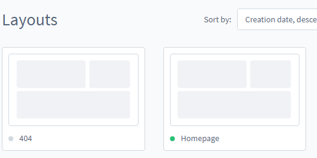
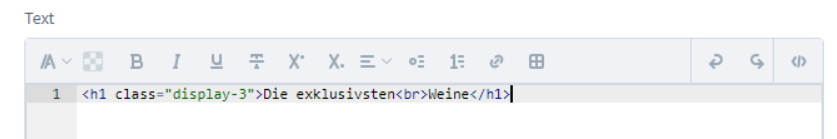
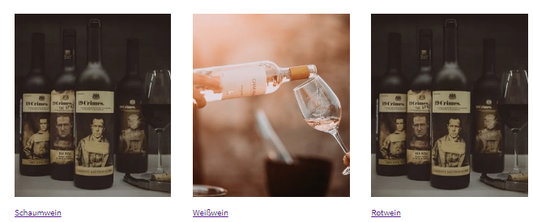

# Shopware Vinoshop Theme

[](https://github.com/vinoshop/shopwaretheme/actions/workflows/deployment_stable.yml)
[](https://github.com/vinoshop/shopwaretheme/actions/workflows/deployment_dev.yml)

To start: ``docker-compose up -d``

## Setup

How to install shopware: https://developer.shopware.com/docs/guides/installation/overview

How to install a theme in shopware: https://docs.shopware.com/en/shopware-6-en/extensions/myextensions

Next, create all the custom fields specified in [administration.md](administration.md).

Then you can start filling in all the custom fields. Their location is specified
in [administration.md](administration.md).

Now you have to create in the administration sections for the homepage layout.



You have to create 4 sections and name them the following:

* landingpage_header --> this section contains the landingpage startImg and the text
    * now you have to add the following blocktypes:
        * image, full-sized
            * block-name: landingpage_top_bg_img
        * Text
            * block-name: landingpage_top_header
            * 
* landingpage_products --> this section contains the header for popular products as well as popular products
    * blocks:
        * text
            * block-name: landingpage_products_header
        * product-slider
            * block-name: landingpage_products
* landingpage_categories --> contains 3 images and links of the categories
    * blocks:
        * three columns, captioned images
            * block-name: landingpage_categories
            * links: /Rotwein, /Weisswein, /Schaumwein
            * 
* landingpage_winzer --> recommended winzer and 2 of his recommended wines
    * blocks:
        * Text:
            * block-name: landingpage_winzer_name
        * image, full-sized
            * block-name: landingpage_winzer_pic
        * product-slider
            * block-name: landingpage_winzer_products

After creating this page, you have to edit the already created index.html.twig file and create a twig file with the name
landingpage.html.twig You can find the index.html.twig file
here ``@VinoshopTheme/src/Resources/views/storefront/page/content/index.html.twig``

Add the following lines to your twig code in the index file:

```
    //this will set the header margin to 0
    
    
    
    
    //add into the already created twig block base_main_inner this
    
    
    
    //put here the code that was here at the beginning
    [...]
    
```

Now create in the same folder as index the new file landingpage.html.twig.

Lastly a service needs to be created since the Products on the landingpage aren't loaded with their manufacturers name.

(see here ``@VinoshopTheme/src/Storefront/Service/AddManufacturerToHomePageProducts.php``)

The service adds the products manufacturer on the even ProductsLoadedEvent. The Service should be called
AddManufacturerToHomePageProducts.php.

Now you have register it as a service in the ``services.xml`` file. Add the following:

```xml

<service id="VinoshopTheme\Storefront\Service\AddManufacturerToHomePageProducts">
    <argument type="service" id="product_manufacturer.repository"/>
    <tag name="kernel.event_subscriber"/>
</service>
```

So now that the landingpage is finished, we can create the manufacturer or winzerpage.

Firstly create winzerpageController ``@VinoshopTheme/src/Storefront/Controller/WinzerpageController.php`` :

2nd register it as a controller in the services.xml file previously mentioned:

```xml

<service id="VinoshopTheme\Storefront\Controller\WinzerpageController" public="true">
    <argument type="service" id="Shopware\Storefront\Page\Navigation\NavigationPageLoader"/>
    <argument type="service" id="Shopware\Storefront\Pagelet\Menu\Offcanvas\MenuOffcanvasPageletLoader"/>
    <call method="setContainer">
        <argument type="service" id="service_container"/>
    </call>
    <argument type="service" id="product_manufacturer.repository"/>
</service>
```

Now you have to create the following twig templates ``@VinoshopTheme/src/Resources/views/storefront/page/winzer``:

* allWinzer.html.twig - shows all winzer in minimal card form
* winzerpage.html.twig - manufacturer specific page
  
Lastly if you want to add email templates to the shopsystem, you have to go to the administration panel/settings/email-templates
    

### Links

* https://developer.shopware.com/docs/guides/plugins/themes/create-a-theme
* https://developer.shopware.com/docs/guides/plugins/plugins/storefront/customize-templates
* https://developer.shopware.com/docs/guides/plugins/plugins/storefront/add-custom-page

docker-compose exec shopware /bin/bash

### when you want to start developing

``./bin/build-storefront.sh``

### reload theme:

```
docker-compose exec shopware /bin/bash
bin/console cache:clear
```

or

``docker-compose exec shopware /bin/bash -c "bin/console cache:clear"``

if you changed js or scss:
``docker-compose exec shopware /bin/bash -c "bin/console theme:compile"``

Alternatively:
https://docs.dockware.io/development/watchers

if js or scss was changed:
``bin/console theme:compile && bin/console cache:clear``

### install theme:

```
docker-compose exec shopware /bin/bash
bin/console plugin:refresh
bin/console plugin:install --activate VinoshopTheme
bin/console theme:change
0
1
bin/console cache:clear
```

### Password for admin

```
shopware
```

### Password for MySQL

```
User: root
Password: root
Port: 3306
```
